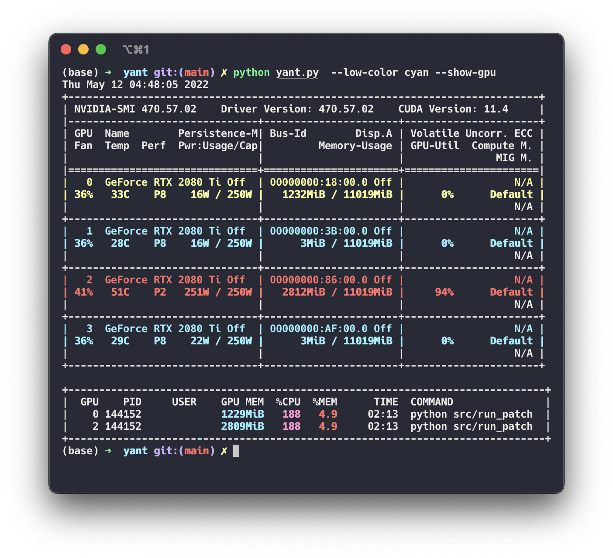

# `yant` - Yet Another Nvidia Top 


If there is one thing we don't have enough of, it's the amount of ways to make `nvidia-smi` actually readable. 

Here's ***Y**et **A**nother **N**vidia **T**op* (or `yant`) written in simple, straightforward python.

## Demo

<p align="center">
  
  </br>
  Sample output of <code>yant</code>.
  </br>
  (Note: <code>USER</code> is removed for privacy protection)
</p>

## Installation

- First, install the required `termcolor` package with `pip3 install termcolor`. 
- Then, you may clone this repository with `git clone`, then `cd yant` into the directory and use `yant` with `python3 yant.py`. Feel free to use flags to customize the outputs. 
- (Optional) To facilitate usage, you can create an alias to `yant` by adding `alias yant="python3 /path/to/yant/yant.py"` to your `~/.bashrc` or `~/.zshrc` file, where `/path/to/yant/` is the result of `pwd` when you are in `yant`'s directory.
- (Optional) To make `yant` more `htop`-like, use the `watch` utility: `watch python3 yant.py`. To get colored output, you have to pass option `-c` to both `watch` and `yant`, e.g. `watch -c yant.py -c`.

- If `yant` is useful to you, please star ⭐️ it to let more people know 🤗, or consider contributing to it!


## Usage

    python3 yant.py

      Print current GPU utilization with better formatting and color support.

      --length [int]                   Adjust length of printed command used by different 
                                       GPUs. `[int]` should be an integer that represents 
                                       the desired amount of characters to print.
                                       Default: print first 100 characters (int=100).

      --colored                        Toggle whether or not to color the output.  
                                       Note: using this flag will mess up outputs 
                                       used with `watch`.                             
      
      --high [float]                   Set threshold value for what is considered a high 
                                       GPU usage. Should be a float value between 0 and 1.
                                       Default: 0.8

      --low [float]                    Set threshold value for what is considered a low 
                                       GPU usage. Should be a float value between 0 and 1.
                                       Default: 0.1
                                       
      --show-gpu                       Toggle GPU name disply. Sometimes `nvidia-smi` 
                                       does not display the full GPU name. Use this flag to 
                                       display the full name.                                     
    
Outputs are color coded, specifically: 
- red means: `GPU utilization` or `GPU memory` >= `high`
- yellow means: `low` <= `GPU utilization` or `GPU memory` < `high`
- green means: `GPU utilization` or `GPU memory` < `low`

Note: for backward compatibility, `nvidia-smi | python3 yant.py` is also supported.

Note: running inside a container (docker, singularity, ...), `nvidia-smi` can only see processes running in the container.


## License
```
DO WHATEVER THE FUCK YOU WANT TO PUBLIC LICENSE 

Copyright (C) 2022 Vincent Wu

Everyone is permitted to copy and distribute verbatim or modified 
copies of this license document, and changing it is allowed as 
long as the name is changed. 

TERMS AND CONDITIONS FOR COPYING, DISTRIBUTION, AND MODIFICATION 

1. DO WHATEVER THE FUCK YOU WANT TO.
2. What did I just say?
```

## Credits
`yant` is inspired by [nvidia-top](https://github.com/peci1/nvidia-htop) and [nvitop](https://github.com/XuehaiPan/nvitop).
